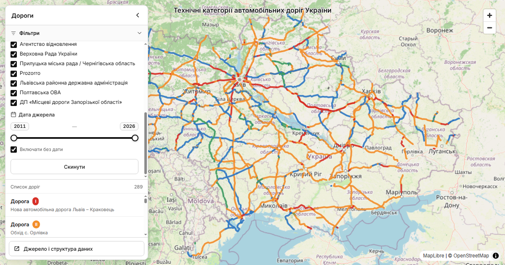

# Технічні категорії автомобільних доріг України

Інтерактивна вебкарта технічних категорій автомобільних доріг України. Проєкт зводить в одному шарі відомості про категорію дороги, межі ділянок, кількість смуг, походження та дату інформації, щоб полегшити перевірку й порівняння даних із різних офіційних джерел.

Карта є дослідницьким доказовим шаром. Вона не є офіційним реєстром, не гарантує повноти всіх автомобільних доріг і не повинна самостійно використовуватися як підтвердження актуального стану конкретної ділянки.



## Що показано на карті

Робочий набір `roads.geojson` містить 1 215 записів для 24 областей України:

- 1 145 записів базового набору 2017 року;
- 55 записів із новішими прямими свідченнями з офіційних джерел;
- 1 212 записів із геометрією та 3 записи без геометрії;
- технічні категорії I–V, позначені окремими кольорами;
- міжнародні, національні, регіональні та інші типи доріг;
- початок і кінець ділянки за пікетажем, область, назву та індекс дороги;
- кількість смуг, якщо її підтверджено вихідними даними;
- систему, документ, дату та посилання на джерело.

В інтерфейсі можна:

- шукати дорогу за назвою або індексом;
- фільтрувати записи за типом дороги, технічною категорією, кількістю смуг, джерелом і датою;
- переглядати атрибути та першоджерело вибраної ділянки;
- скидати фільтри й завантажувати відібрані дані у GeoJSON.

### Обмеження даних

Основою карти є відкритий набір 2017 року про техніко-експлуатаційний стан доріг державного значення. Новіші записи доповнено прямими згадками технічної категорії в ЄДЕССБ, Prozorro, документах Верховної Ради України, Агентства відновлення, обласних і місцевих органів.

Дати та зміст джерел різняться. Частина новіших документів описує проєктний або майбутній стан після реконструкції, а не обов'язково фактичний стан дороги на сьогодні. Для новіших записів без власної геометрії ділянки могли бути відновлені за базовою геометрією 2017 року або за OpenStreetMap. OpenStreetMap не використовувався як джерело технічної категорії.

Перед практичним використанням перевіряйте поле джерела, дату, статус і примітки конкретного запису.

## Структура репозиторію

- `index.html` — статичний застосунок на MapLibre GL JS;
- `roads.geojson` — актуальний робочий набір, який завантажує карта;
- `preview.png` — зображення для README та Open Graph;
- `research/` — попередні версії GeoJSON, дослідницькі CSV і технічні звіти;
- `LICENSE` — MIT License для авторського коду й тексту документації;
- `DATA_LICENSE.md` — походження, атрибуція та умови повторного використання даних.

## Локальний запуск

Відкриття `index.html` через `file://` може блокувати завантаження локального GeoJSON. Запустіть у корені репозиторію простий HTTP-сервер.

У Windows:

```powershell
py -m http.server 8000
```

Якщо команда `py` недоступна:

```powershell
python -m http.server 8000
```

Після цього відкрийте [http://localhost:8000](http://localhost:8000). Щоб зупинити сервер, натисніть `Ctrl+C` у терміналі.

Збирання та встановлення пакетів не потрібні. Підключення до інтернету потрібне для завантаження MapLibre GL JS і CSS, шрифту Inter із Google Fonts та растрових тайлів OpenStreetMap. Сам файл `roads.geojson` подається локальним сервером.

## Джерела даних

Основні групи джерел:

- [data.gov.ua — дані щодо техніко-експлуатаційного стану автомобільних доріг](https://data.gov.ua/dataset/beca8aa5-96a9-46be-ade7-f1b400213af5);
- Єдина державна електронна система у сфері будівництва (ЄДЕССБ);
- Prozorro;
- нормативні та розпорядчі документи, оприлюднені органами державної влади й місцевого самоврядування;
- [OpenStreetMap](https://www.openstreetmap.org/copyright) — картографічна основа та окремі відновлені геометрії, але не технічні категорії.

Повний дослідницький реєстр міститься у [`research/Реєстр_джерел_категорій_доріг_Україна.csv`](research/Реєстр_джерел_категорій_доріг_Україна.csv). У кожному записі робочого GeoJSON також збережено поля джерела й, де можливо, пряме посилання на документ.

## Авторство

Автор проєкту: [@suprun](https://github.com/suprun).

## Ліцензії

Авторський код і текст документації поширюються за [MIT License](LICENSE).

MIT License не поширюється автоматично на `roads.geojson`, матеріали в `research/`, картографічну основу та інший вміст третіх сторін. Для даних діють умови першоджерел, зокрема:

- базовий набір data.gov.ua — Creative Commons Attribution 4.0 International із обов'язковим посиланням на джерело;
- дані OpenStreetMap — Open Data Commons Open Database License 1.0 (ODbL), © OpenStreetMap contributors;
- MapLibre GL JS 4.7.1 — BSD 3-Clause License.

Докладні умови й рекомендована атрибуція наведені в [`DATA_LICENSE.md`](DATA_LICENSE.md).
